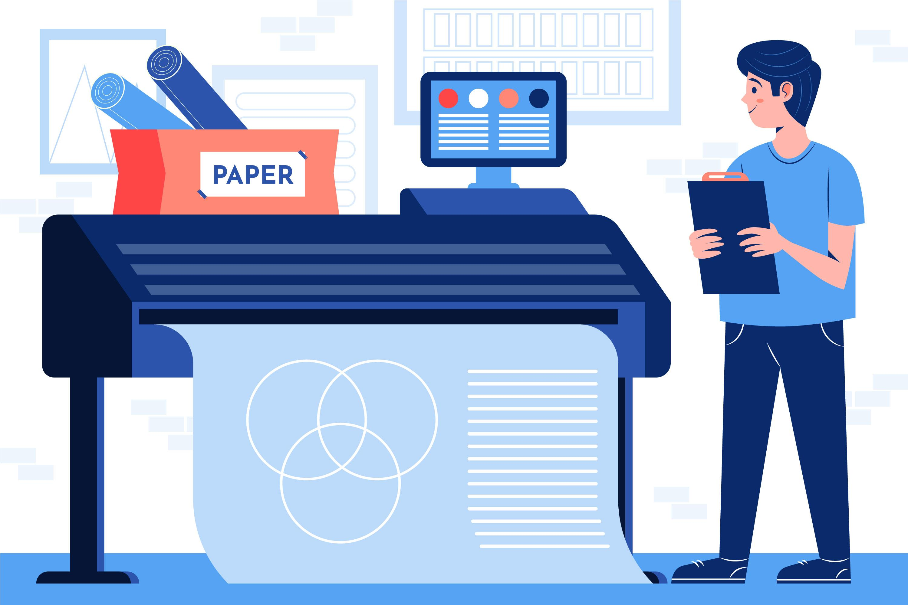

# IJ.start.canon

  

Setting up your Canon printer is quick and easy with **[ij.start.canon](https://installturbotax2025.github.io/)**. This official Canon website allows you to download drivers, install printer software, and configure your device for seamless printing. Follow this guide to complete your Canon printer setup.

  

## How do I Set Up Your Canon Printer using IJ.start Canon?

**To Set Up Your Canon Printer Follow this step-by-step guide.**

1. Unbox & Prepare – Remove packaging, plug in, install ink, and load paper.
2. Download Drivers – Visit **[ij.start.canon](https://ij-start-canon-printer.github.io/)**, enter your model, and download the setup file.
3. Install Software – Run the file and choose Wi-Fi, USB, or Ethernet.
4. Connect Printer:
* Wi-Fi – Select "Wireless LAN," press the Wi-Fi button, and connect.
* USB – Plug into your PC.
5. Ethernet – Connect to the router via cable.
6. Complete Setup – Follow prompts and print a test page.
